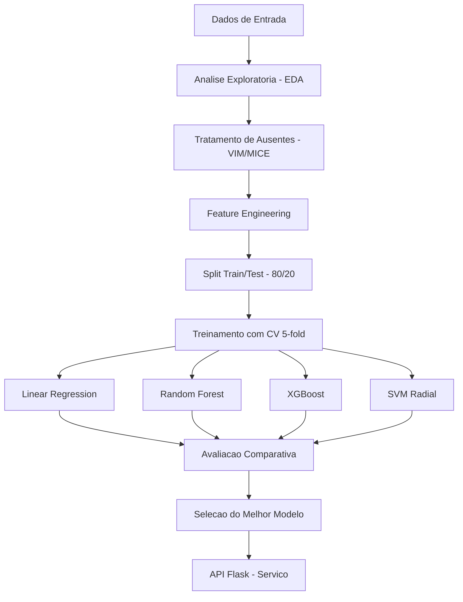
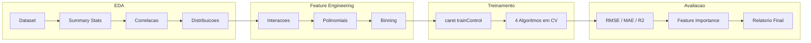
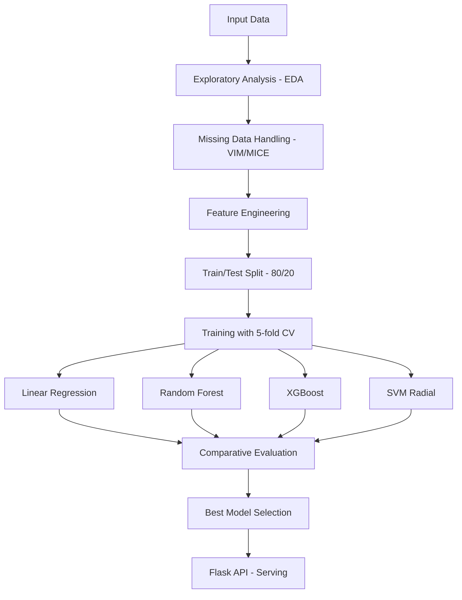
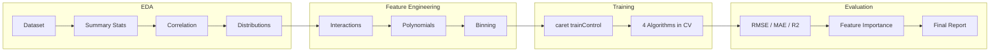

<div align="center">

# Predictive Modeling Platform

[](https://www.r-project.org/)
[](https://www.python.org/)
[](https://topepo.github.io/caret/)
[](https://xgboost.readthedocs.io/)
[](Dockerfile)
[](LICENSE)

**Plataforma de modelagem preditiva com multiplos algoritmos, feature engineering automatizado e comparacao de modelos.**

**Predictive modeling platform with multiple algorithms, automated feature engineering, and model comparison.**

[Portugues](#portugues) | [English](#english)

</div>

---

## Portugues

### Sobre

O **Predictive Modeling Platform** e uma plataforma completa de modelagem preditiva em R que integra analise exploratoria, engenharia de features, treinamento de multiplos algoritmos (Regressao Linear, Random Forest, XGBoost, SVM) e avaliacao comparativa. O sistema utiliza validacao cruzada k-fold, gera visualizacoes automaticas com ggplot2/corrplot/plotly, e trata dados ausentes com VIM/MICE. Um backend Flask complementar serve predicoes via API REST, e o frontend JavaScript oferece monitoramento interativo.

### Tecnologias

| Camada | Tecnologia | Versao | Finalidade |
|--------|-----------|--------|------------|
| Core | R | 4.3 | Linguagem principal de modelagem |
| ML Framework | caret | 6.0 | Treinamento e validacao de modelos |
| Ensemble | Random Forest | - | Modelos de ensemble baseados em arvores |
| Boosting | XGBoost | 2.0 | Gradient boosting de alta performance |
| Visualizacao | ggplot2 + plotly | - | Graficos estaticos e interativos |
| Dados | dplyr + tidyr | - | Manipulacao e transformacao de dados |
| Imputacao | VIM + MICE | - | Tratamento de dados ausentes |
| API | Flask (Python) | 3.0 | Servico de predicoes REST |
| Frontend | JavaScript ES6+ | - | Painel de monitoramento |
| Infra | Docker | - | Containerizacao R |

### Arquitetura



### Fluxo de Modelagem



### Estrutura do Projeto

```
Predictive-Modeling-Platform/
├── advanced_modeling.R      # Plataforma OOP de modelagem (347 LOC)
├── analytics.R              # Modulo de analise estatistica (62 LOC)
├── app.py                   # API Flask REST (30 LOC)
├── app.js                   # Frontend interativo ES6+ (214 LOC)
├── index.html               # Interface web responsiva (74 LOC)
├── styles.css               # Estilos CSS3 modernos (160 LOC)
├── tests/
│   └── test_main.R          # Suite de testes R (17 LOC)
├── Dockerfile               # Container R production (11 LOC)
├── requirements.txt         # Dependencias Python
├── .gitignore
└── LICENSE                  # MIT
```

**Total: ~915 linhas de codigo-fonte**

### Inicio Rapido

```bash
git clone https://github.com/galafis/Predictive-Modeling-Platform.git
cd Predictive-Modeling-Platform
```

```r
# Instalar dependencias R
install.packages(c("ggplot2", "dplyr", "caret", "randomForest",
                    "xgboost", "corrplot", "plotly", "tidyr",
                    "VIM", "mice"))

# Executar pipeline completo
source("advanced_modeling.R")
```

Para a API Flask:

```bash
pip install -r requirements.txt
python app.py
```

### Docker

```bash
docker build -t predictive-platform .
docker run -p 3838:3838 predictive-platform
```

### Testes

```r
library(testthat)
test_dir("tests/")
```

### Benchmarks

| Componente | Metrica | Valor |
|-----------|---------|-------|
| EDA Completa | 1K observacoes, 6 features | < 3s |
| Feature Engineering | Geracao de 6 novas features | < 0.5s |
| Treinamento LM | CV 5-fold, 1K amostras | < 1s |
| Treinamento RF | 100 arvores, CV 5-fold | < 15s |
| Treinamento XGBoost | CV 5-fold, tuning padrao | < 10s |
| Avaliacao Completa | 4 modelos, todas metricas | < 2s |

### Aplicabilidade Industrial

| Setor | Caso de Uso | Beneficio |
|-------|------------|-----------|
| Financeiro | Modelagem de risco de credito | Comparacao automatica de 4 algoritmos |
| Imobiliario | Avaliacao de imoveis | Predicao de preco com feature engineering |
| Saude | Predicao de custos hospitalares | Selecao de modelo por performance |
| Marketing | Previsao de LTV de clientes | Segmentacao com importancia de features |
| Energia | Previsao de consumo | Modelos ensemble para series temporais |
| Seguros | Precificacao de apolices | Analise de variaves com maior impacto |

### Autor

**Gabriel Demetrios Lafis**
- GitHub: [@galafis](https://github.com/galafis)
- LinkedIn: [Gabriel Demetrios Lafis](https://linkedin.com/in/gabriel-demetrios-lafis)

### Licenca

Este projeto esta licenciado sob a Licenca MIT - veja o arquivo [LICENSE](LICENSE) para detalhes.

---

## English

### About

**Predictive Modeling Platform** is a comprehensive predictive modeling platform in R that integrates exploratory analysis, feature engineering, training of multiple algorithms (Linear Regression, Random Forest, XGBoost, SVM), and comparative evaluation. The system uses k-fold cross-validation, generates automatic visualizations with ggplot2/corrplot/plotly, and handles missing data with VIM/MICE. A complementary Flask backend serves predictions via REST API, and the JavaScript frontend provides interactive monitoring.

### Technologies

| Layer | Technology | Version | Purpose |
|-------|-----------|---------|---------|
| Core | R | 4.3 | Primary modeling language |
| ML Framework | caret | 6.0 | Model training and validation |
| Ensemble | Random Forest | - | Tree-based ensemble models |
| Boosting | XGBoost | 2.0 | High-performance gradient boosting |
| Visualization | ggplot2 + plotly | - | Static and interactive plots |
| Data | dplyr + tidyr | - | Data manipulation and transformation |
| Imputation | VIM + MICE | - | Missing data handling |
| API | Flask (Python) | 3.0 | REST prediction service |
| Frontend | JavaScript ES6+ | - | Monitoring dashboard |
| Infra | Docker | - | R containerization |

### Architecture



### Modeling Flow



### Project Structure

```
Predictive-Modeling-Platform/
├── advanced_modeling.R      # OOP modeling platform (347 LOC)
├── analytics.R              # Statistical analysis module (62 LOC)
├── app.py                   # Flask REST API (30 LOC)
├── app.js                   # Interactive ES6+ frontend (214 LOC)
├── index.html               # Responsive web interface (74 LOC)
├── styles.css               # Modern CSS3 styles (160 LOC)
├── tests/
│   └── test_main.R          # R test suite (17 LOC)
├── Dockerfile               # R production container (11 LOC)
├── requirements.txt         # Python dependencies
├── .gitignore
└── LICENSE                  # MIT
```

**Total: ~915 lines of source code**

### Quick Start

```bash
git clone https://github.com/galafis/Predictive-Modeling-Platform.git
cd Predictive-Modeling-Platform
```

```r
# Install R dependencies
install.packages(c("ggplot2", "dplyr", "caret", "randomForest",
                    "xgboost", "corrplot", "plotly", "tidyr",
                    "VIM", "mice"))

# Run complete pipeline
source("advanced_modeling.R")
```

For the Flask API:

```bash
pip install -r requirements.txt
python app.py
```

### Docker

```bash
docker build -t predictive-platform .
docker run -p 3838:3838 predictive-platform
```

### Tests

```r
library(testthat)
test_dir("tests/")
```

### Benchmarks

| Component | Metric | Value |
|-----------|--------|-------|
| Full EDA | 1K observations, 6 features | < 3s |
| Feature Engineering | Generate 6 new features | < 0.5s |
| LM Training | 5-fold CV, 1K samples | < 1s |
| RF Training | 100 trees, 5-fold CV | < 15s |
| XGBoost Training | 5-fold CV, default tuning | < 10s |
| Full Evaluation | 4 models, all metrics | < 2s |

### Industry Applicability

| Sector | Use Case | Benefit |
|--------|----------|---------|
| Finance | Credit risk modeling | Automatic comparison of 4 algorithms |
| Real Estate | Property valuation | Price prediction with feature engineering |
| Healthcare | Hospital cost prediction | Model selection by performance |
| Marketing | Customer LTV forecasting | Segmentation with feature importance |
| Energy | Consumption forecasting | Ensemble models for time series |
| Insurance | Policy pricing | Analysis of highest-impact variables |

### Author

**Gabriel Demetrios Lafis**
- GitHub: [@galafis](https://github.com/galafis)
- LinkedIn: [Gabriel Demetrios Lafis](https://linkedin.com/in/gabriel-demetrios-lafis)

### License

This project is licensed under the MIT License - see the [LICENSE](LICENSE) file for details.
